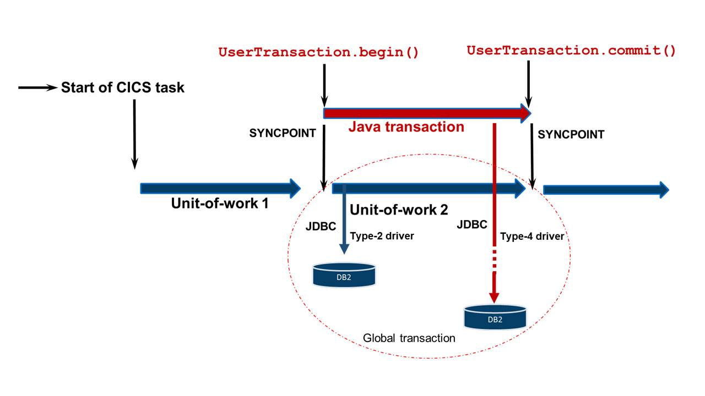

Using Java Transactions in CICS Liberty to coordinate JDBC updates
==================================================================

Author: Alexander Brown

In CICS TS V5.2 the Liberty JVM server was enhanced to support the Java
Transaction API (JTA). JTA enables Java EE Web applications that are
running in CICS Liberty to coordinate transactional updates between CICS
resources and XA resources. In a typical scenario the CICS resource
could be a VSAM file while the XA resource might be a remote DB2
database using JDBC type 4 connectivity. This article shows you how to
develop a simple web application using JTA.

Requirements
------------

For the example in this tutorial, the following minimum prerequisites
apply:

-   CICS TS V5.2
-   A configured Liberty JVM server, for instance see
    [Starting a CICS Liberty JVM server in 4 easy steps](https://www.ibm.com/developerworks/community/blogs/cicsdev/entry/liberty_jvm_servers_a_quickstart_guide).

What is JTA?
------------

The Java Transaction API (JTA) is a high-level interface for
coordinating global transactions using the Java programming language.
This API is implemented by different runtimes, including WebSphere
Liberty. JTA is exposed to application developers through a
`UserTransaction`; a Java class which provides methods for controlling
transactions.

A Java transaction can be thought of as the Java version of a CICS
unit-of-work (UOW); both are controlled by transaction managers and
coordinate updates to recoverable resources. However, because the Java
runtime environment is not natively transactional, there has to be a
beginning and an end to the logical unit of work. Beginning a Java
transaction can be thought of as performing a syncpoint. The end of a
Java transaction can either be another syncpoint or a rollback,
depending on the scenario. CICS is inherently transactional and a UOW is
always started at CICS task attach time. The CICS UOW exists whether
there is a JTA transaction or not.

In a CICS Liberty JVM server with JTA configured, beginning a Java
transaction will create a new subordinate CICS UOW. This UOW is used to
control the transactional behaviour of CICS resources such as VSAM files
and recoverable TSQs. It also controls updates to CICS RMI resources
such as a local DB2 or MQ instance. However, recoverable updates to a
remote data source using JDBC type 4 connectivity will be controlled by
the Java transaction and the Liberty transaction manager, allowing
transactional coordination of both the CICS UOW and the remote data
source in the same global transaction, as shown below.



Example
-------

In this example we will look at a Java servlet which writes to a
recoverable CICS temporary storage queue (TSQ) and also accesses a
remote DB2 database using JDBC type 4 connectivity. The TSQ should be
defined as recoverable by using a CICS
[TSMODEL](https://www.ibm.com/support/knowledgecenter/SSGMCP_5.2.0/com.ibm.cics.ts.resourcedefinition.doc/resources/tsmodel/dfha4_attributes.html)
definition that specifies the attributes `RECOVERY(YES)`. A DataSource
must be [defined in the Liberty
server](https://www.ibm.com/support/knowledgecenter/SS7K4U_liberty/com.ibm.websphere.wlp.zseries.doc/ae/twlp_dep_configuring_ds.html)
configuration file and support XA by specifying the
`java.sql.XADataSource` property on the dataSource element. For example:

``` {.brush: .xml; .gutter: .false; .title: .; .notranslate title=""}
  <dataSource id="db2xa" jndiName="jdbc/db2xa" type="javax.sql.XADataSource">
    <jdbcDriver libraryRef="DB2JCC4Lib"/>
    <properties.db2.jcc databaseName="SAMPLEDB" serverName="localhost" portNumber="50000"/>
  </dataSource>
```

Our sample Java servlet is shown below and illustrates how the
UserTransaction interface can be used to coordinate updates to both CICS
and a remote DB2 database.

``` {.brush: .java; .highlight: .[4,5,7,8,17,21,25,27,33]; .title: .; .notranslate title=""}
@WebServlet("/JTAServlet")
public class JTAServlet extends HttpServlet
{
    @Resource
    private UserTransaction transaction;

    @Resource("jdbc/mydb")
    private DataSource dataSource;

    protected void doPost(HttpServletRequest request, HttpServletResponse response) throws ServletException, IOException
    {
        Connection conn = null;
        Statement stmt = null;

        try
        {
            transaction.begin();

            TSQ tsq = new TSQ();
            tsq.setName("RECOVERABLEQ");
            tsq.writeString("My data");

            conn = dataSource.getConnection();
            stmt = conn.createStatement();
            stmt.executeUpdate("INSERT INTO schema.tablename(column) DATA('My data')");

            transaction.commit();
        }
        catch(Exception e)
        {
            try
            {
                transaction.rollback();
            }
            catch(Exception tE)
            {
                // Syncpoint failure, so wrap this exception and throw servlet exception
                throw new ServletException(tE);
            }
        }
        finally
        {
            try
            {
                stmt.close
            }
            catch(SQLException e)
            {
                e.printStackTrace();
            }

            try
            {
                conn.close();
            }
            catch(SQLException e)
            {
                e.printStackTrace();
            }
        }
    }
}
```

The example source code has been annotated to display the key steps as
follows:

-   **4-5** & **7-8.** The UserTransaction and DataSource interfaces are
    injected as instance variables to avoid a JNDI lookup of these
    resources on every request. This works because the transaction
    context is scoped to the current thread and not the UserTransaction
    object; so it can be safely used as an instance variable across
    multiple requests and separate methods.
-   **17.** When a JTA transaction is started, the Liberty transaction
    manager creates an XA transaction, which is defined by a unique XID,
    at the same time CICS creates a new UOW, which is mapped to the XA
    transaction using a UOWLINK.
-   **21.** When a recoverable CICS resource such as a TSQ is updated
    then the updates will be coordinated using the subordinate CICS UOW.
-   **25.** When modifying an external XA capable resource (in this case
    a remote database) the XID is passed to the resource manager of that
    resource to identify the transaction occurring.
-   **27.** If the transaction should complete successfully, the Liberty
    transaction manager drives a commit. In this example the transaction
    manager must drive a two phase commit. The Liberty server sends a
    'prepare to commit' to both CICS and the remote database. Both of
    these then return a response as to whether they are ready to commit
    back to Liberty. If both are ready, the Liberty server then tells
    them to commit and waits for both of them to acknowledge that they
    have committed before it counts the transaction as complete.
-   **33.** If a Java exception is thrown then we catch the failure and
    invoke the rollback method on the UserTransaction. This causes the
    Liberty transaction manager to back-out any changes made within the
    Java transaction. Liberty sends a rollback command to both CICS and
    the remote database, which will then undo all their changes and
    acknowledge that the rollback has occurred. Note: it is generally
    bad practice to catch the generic Exception type but we do it here
    for simplicity of the sample.

Note: JDBC 4.1 allows the use of the try-with-resources syntax
introduced in Java SE 7 on `Connection` and `Statement` and is supported
in CICS TS V5.3 via using Java EE 7 via APAR
[PI63877](https://www.ibm.com/support/pages/apar/PI63877).

CICS operational considerations
-------------------------------

Java EE web applications can be packaged as part of a basic web-based
project (deployed as a WAR file), or as part of an OSGi application
project (deployed as an EBA file). Both WARs and EBAs can be included in
a CICS bundle. In a Liberty JVM server the JTA capability is provided by
default as part of the `cicsts:core-1.0` feature.

The Liberty transaction log directory, the `tranlog`, is used to store
the state of all Java transactions within the Liberty server, the
location of this log defaults to the working directory of the Liberty
JVM server, typically
`&USSHOME;/<applid>/<jvmserver>/wlp/usr/serverName/`, but can be
configured in the Liberty server configuration file using the XML
element:

``` {.brush: .xml; .gutter: .false; .title: .; .notranslate title=""}
<transaction transactionLogDirectory="/var/cics/tranlog/${com.ibm.cics.jvmserver.applid}/${com.ibm.cics.jvmserver.name}"/>
```

Once a Java transaction is active the subordinate CICS UOW and its CICS
task can be viewed by inquiring on the UOWLINK, UOW and Task resources
using CEMT or CICS Explorer. Beneath the covers, JTA creates an XA
transaction which is used to co-ordinate the recoverable work between
the different parties. The XA transaction is referenced using a unique
XID which is then used by the transaction manager to coordinate updates
across all the resource managers in the global transaction. The CICS
UOWLINK is used to map the reference between the CICS UOW and the XID
and stores a reference to the XID using the Branch Qualifier and Global
Transaction Identifier components as shown.

There is an interesting difference between JDBC type 2 connectivity and
JDBC type 4 connectivity when using a DB2 database in a CICS system.
With JDBC type 2 connectivity connections are handled by CICS using a
DB2CONN resource. With JDBC type 4 connectivity there is an independent
Java transaction manager. This means when using a JTA transaction which
updates both CICS resources and a database, it will depend on the
connection type as to whether a one-phase or two-phase commit is issued.
If using type 2 connectivity, the JTA transaction only connects to the
CICS UOW, therefore only a one-phase commit is necessary. However, with
type 4 connectivity, there are two transaction managers involved, so a
two-phase commit is required to ensure transactional behavior.

Recovery
--------

When failures occur within transactions, it is important to know how the
application server handles the failures. These failures can take a
number of forms -- unchecked exceptions from Java, ABENDs from CICS or
even system failure.

In error scenarios, rollback will be performed on all in-flight
transactions on that task. Transactions that are in-doubt and controlled
by Liberty (through a JTA transaction) have their details written to the
transaction log, allowing the transaction to be recovered or backed out
as necessary by the recovery manager. In CICS, UOW recovery is treated
in the same way as if the UOW was subordinate to another CICS region, in
the event of Liberty server failure, they will not recover until the
Liberty JVM server has been re-enabled.

In the case of a CICS failure, a CICS emergency restart will recover all
non-Liberty related UOWs and re-enable the Liberty JVM server. When this
happens, Liberty will read its tranlog and invoke the recovery method
for each resource (the XAResource) which was active at the time of
failure, sending an XA recovery flow to any remote data source that was
used and to the CICS recovery manager. This retrieves all XIDs
associated with unfinished transactions and returns them to the Liberty
transaction manager, which then manages the commit, forget or rollback
using the XA resources as appropriate.

Disconnecting JTA from the CICS UOW
-----------------------------------

In CICS TS V5.3, there are scenarios where you might want the CICS UOW
and JTA transactions to operate independently. An example of this is
when using the **REQUIRES_NEW** EJB transaction attribute to create
nested transactions. If the JTA transaction and CICS UOW are integrated
at this point, the application will fail because CICS does not support
nested UOWs.

To prevent the integration of JTA and CICS UOWs across a particular
Liberty JVM server, add the following element to the Liberty
`server.xml` configuration file:

``` {.brush: .xml; .gutter: .false; .title: .; .notranslate title=""}
  <cicsts_jta integration="false"/>
```

References
----------

This article has shown how JTA can be used and set up on a CICS Liberty
JVM server. The following links provide more information on JTA and Java
transactions in CICS.

-   [JTA specification](http://www.oracle.com/technetwork/java/javaee/jta/index.html)
-   [CICS JTA documentation](http://www.ibm.com/support/knowledgecenter/SSGMCP_5.3.0/com.ibm.cics.ts.java.doc/topics/dfhpj2_jta.html)
-   [CICS Transaction Processing](http://www-01.ibm.com/support/knowledgecenter/SSGMCP_5.3.0/com.ibm.cics.ts.productoverview.doc/concepts/TransactionProcessing.html)
